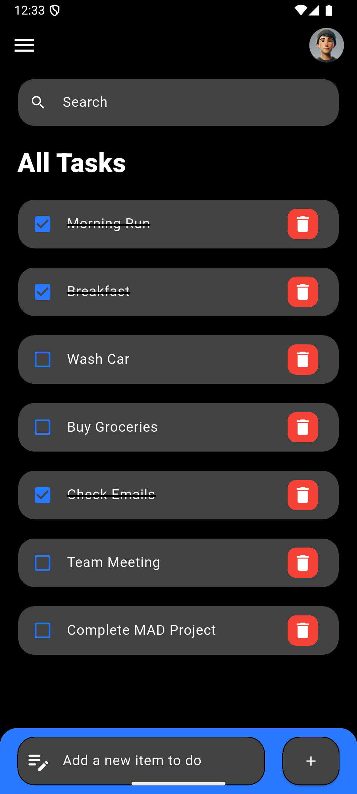
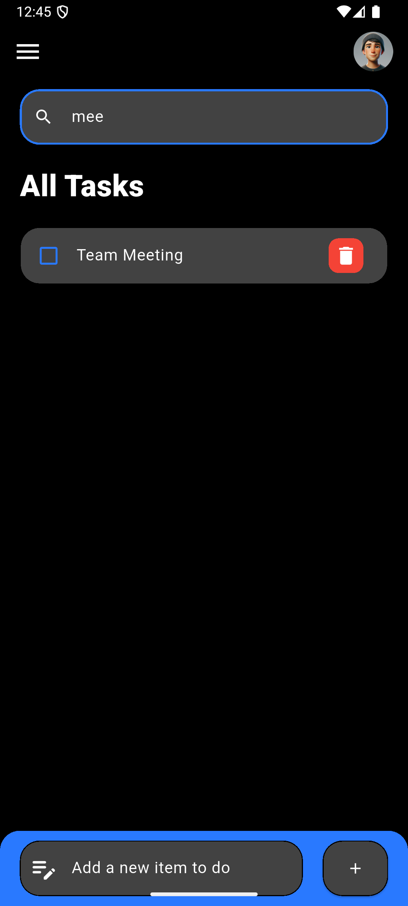
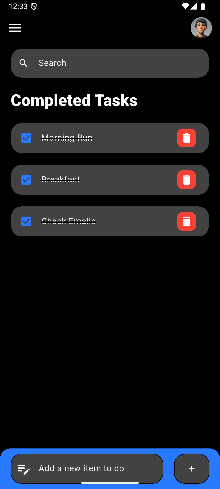
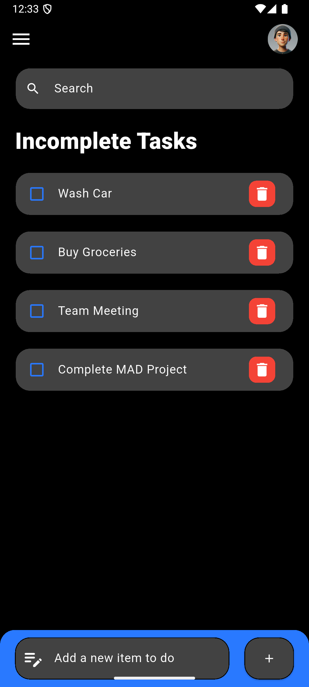

# Flutter To-Do App 📱
A simple and elegant To-Do List Flutter app that allows users to add, delete, and mark tasks as completed or incomplete. The app features a search bar to filter tasks and a side drawer for easy navigation between all tasks, completed tasks, and incomplete tasks.

## Features 🚀
- **Add Tasks**: Easily add new tasks to your to-do list ➕
- **Delete Tasks**: Remove tasks when no longer needed  🗑️
- **Mark Tasks as Completed or Incomplete**: Toggle between completed and incomplete tasks ✅❌
- **Search Functionality**: Search tasks by their name for quick access  🔍
- **Drawer Navigation**: Navigate between views for All Tasks, Completed Tasks, and Incomplete Tasks  🗂️

## Screenshots 📸
### **Home Page**

### **Search Bar Functionality**

### **Drawer**

### **Completed Tasks Via Drawer**

### **InComplete Tasks Via Drawer**

## Tech Stack ⚙️
- **Flutter**: Framework for building the app.
- **Dart**: Programming language used in Flutter for the development of the app.
- **VS Code / Android Studio**: Integrated Development Environments (IDEs) used for coding and testing the app.
- **Git**: Version control tool for source code management.